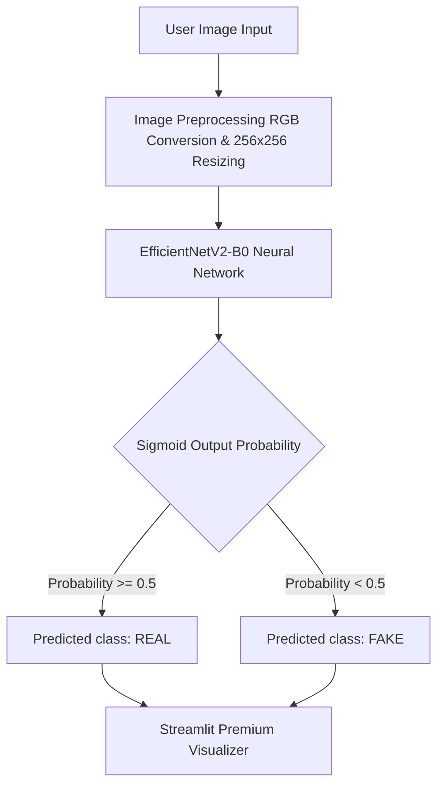

# Real vs Fake Face Detection System

[](https://link.springer.com/chapter/10.1007/978-3-031-92854-3_16)
[](https://www.python.org/)
[](https://real-vs-fake-face.streamlit.app/)
[](https://tensorflow.org/)

An advanced deep learning framework designed to detect AI-generated fake faces (deepfakes) and verify digital media authenticity. This repository contains the official implementation of the peer-reviewed research paper published in **Springer**.

🔗 **Read the Research Paper:** [Springer Link](https://link.springer.com/chapter/10.1007/978-3-031-92854-3_16)  
🚀 **Live Application Demo:** [real-vs-fake-face.streamlit.app](https://real-vs-fake-face.streamlit.app/)  
💼 **Developer Portfolio:** [portfolio-self-one-10.vercel.app](https://portfolio-self-one-10.vercel.app/)

---

## 📖 Research Abstract & Methodology

As generative models (such as StyleGAN) produce hyper-realistic human faces indistinguishable from real photos, they pose serious security and verification challenges. This project implements a modern detection pipeline:

1. **Model Architecture:** We employ an optimized **EfficientNetV2-B0** classifier, customized and fine-tuned for high-accuracy binary classification (Real vs. Fake).
2. **Dataset:** Trained on the **140k Real and Fake Faces** dataset, mapping complex local features and high-frequency generator artifacts.
3. **Key Findings:** Achieved a peak validation accuracy of **94%**, demonstrating robust performance in digital forensics scenarios.

---

## ⚙️ System Architecture



---

## 📁 Repository Structure

```
├── app.py                     # Main Streamlit dashboard entrypoint
├── src/                       # Production application source code
│   ├── styles.py              # Premium CSS layout injections
│   ├── model_loader.py        # Safe model loading & error handling
│   └── inference.py           # Preprocessing & model inference
├── notebooks/                 # Model training and notebook development
│   └── model_training.ipynb   # Original training workflow & evaluation logs
├── research/                  # PyTorch model architecture definitions
│   └── model_pytorch.py       # ResNet50 baseline research code
└── requirements.txt           # Python environment dependencies
```

---

## 🚀 Setup & Execution

### 1. Prerequisites
Ensure you have Python 3.9 or higher installed.

### 2. Installation
Clone the repository and install the required dependencies:

```bash
git clone https://github.com/Pranav427/A-Modern-Security-Advance-System-for-Detection-of-Real-and-Fake-Human-Faces.git
cd A-Modern-Security-Advance-System-for-Detection-of-Real-and-Fake-Human-Faces
pip install -r requirements.txt
```

### 3. Model Weights
Place your trained Keras/TensorFlow weight file `dffnetv2B0.h5` in the root directory. 

*(Note: `dffnetv2B0.json` is no longer required as model structure deserialization is now constructed dynamically via code for cross-version compatibility).*

### 4. Multi-Framework Comparative Research
This project evaluates both TensorFlow and PyTorch baselines for experimental validation:
* **Production Model (TensorFlow/Keras):** Deployed live in the Streamlit application for high-performance CPU inference.
* **Baseline Research Baselines (PyTorch):** Scripts located in [research/](file:///Users/pranavobili/Downloads/%20project%204.2/research) (e.g. `model_pytorch.py`) are kept for training baseline comparisons against ResNet architectures.

### 5. Running the Local Demo
Launch the interactive Streamlit dashboard:

```bash
streamlit run app.py
```

---

## 📑 How to Cite

If you use this codebase or research in your studies, please cite our Springer publication:

```bibtex
@InProceedings{obili2025modern,
  author    = {Obili, Pranav},
  title     = {A Modern Security Advance System for Detection of Real and Fake Human Faces},
  booktitle = {International Conference on Advanced Security Systems},
  year      = {2025},
  publisher = {Springer},
  doi       = {10.1007/978-3-031-92854-3_16}
}
```
